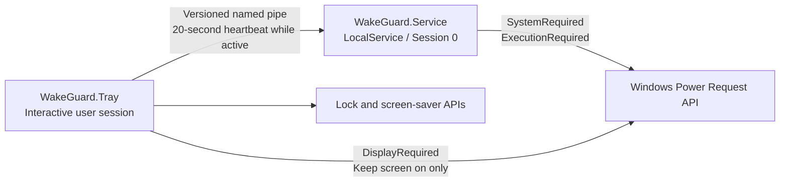

<div align="center">
  
  <h1>WakeGuard</h1>
  <p><strong>Keep Windows working after the display turns off or the session is locked.</strong></p>
  <p>Windows 10/11 x64 | Lightweight native service | MIT licensed</p>
</div>

WakeGuard is a small Windows tray application that prevents idle sleep and Modern
Standby while still letting Windows manage the display, lock screen, power plan,
and lid behavior.

It does not simulate mouse or keyboard input, periodically fake user activity, or
rewrite the system power plan. WakeGuard uses the documented Windows Power Request
API and a low-privilege background service so the request remains reliable after
the interactive session is locked.

## Highlights

- Three clear modes: **System default**, **Keep awake**, and **Keep screen on**.
- Optional durations: unlimited, 30 minutes, 1 hour, 2 hours, or 4 hours.
- One-click lock and screen-saver actions that do not change the active mode or timer.
- A compact Windows 11-style left-click control panel.
- A native right-click tray menu containing only **Settings** and **Exit**.
- Per-user startup preference and a Chinese/English interface.
- Reliable locked-session behavior through a `LocalService` Windows service.
- Demand-start service activation through a native named-pipe service trigger.
- Automatic lease expiry and idle service shutdown, so no service remains resident
  when WakeGuard is inactive.

## How to use it

### Left-click: wake controls


Left-click the tray icon to open the control panel. Selecting a mode or duration
does not close the panel, so the normal workflow can be completed with a few clicks.

| Mode | Keeps the system awake | Keeps the display on | Behavior |
| --- | :---: | :---: | --- |
| **System default** | No | No | Releases WakeGuard's power requests and returns control to Windows. |
| **Keep awake** | Yes | No | Background work continues; display timeout and automatic locking still follow Windows settings. |
| **Keep screen on** | Yes | Yes | Keeps both the system and display awake. |

After selecting an active mode, choose a duration:

- **Unlimited**
- **30 min**
- **1 hour**
- **2 hours**
- **4 hours**

The panel shows the remaining time and the local end time. When the timer expires,
WakeGuard releases its requests and returns to **System default**. Timer expiry does
not initiate sleep, hibernation, shutdown, locking, or any other action; Windows
simply resumes applying its own power policy.

The bottom row contains two immediate actions:

- **Lock computer** locks the current workstation.
- **Start screen saver** starts the configured screen saver, or the built-in blank
  screen saver when no custom screen saver is configured.

These actions do not change the selected wake mode or duration. Starting a screen
saver also does not automatically lock Windows; whether credentials are required
on resume depends on the Windows screen-saver settings.

### Right-click: application menu

Right-click the tray icon to open a native Windows menu:

- **Settings...** opens the settings window.
- **Exit** releases this user's active request and closes the tray application.

### Settings

The settings window contains:

- **Start with Windows**: creates or removes the current user's
  `HKCU\Software\Microsoft\Windows\CurrentVersion\Run\WakeGuard` value.
- **Language**: switches the tray UI immediately between Chinese and English.
- **About**: displays the installed product version and application information.

Settings are stored per user in `%LOCALAPPDATA%\WakeGuard\settings.json`. A fresh
installation defaults to starting WakeGuard when the current user signs in.

## Installation

1. Download the current `WakeGuard-<version>-win-x64.msi` from
   [GitHub Releases](https://github.com/su27/wakeguard/releases).
2. Run the MSI and approve the administrator prompt. Elevation is required only to
   install the service and write files under `Program Files`.
3. Start **WakeGuard** from the Start menu.
4. Left-click its notification-area icon to select a wake mode. Right-click it to
   open Settings or exit.

Release binaries are self-contained; the .NET runtime does not need to be installed
separately.

> WakeGuard is not currently Authenticode-signed. Windows may therefore show an
> "Unknown publisher" warning. Always download the installer from this repository's
> Releases page and verify its published checksum when one is provided.

### Upgrade

Run a newer MSI directly. Windows Installer closes the old tray process, stops the
service, replaces the installed files, and preserves the per-user settings. The
service remains stopped until the tray next requests an active wake mode.

### Uninstall

Remove WakeGuard from **Settings > Apps > Installed apps**. The installer stops and
removes the service and releases its power requests. WakeGuard never edits the
Windows power plan, so no power-plan restoration is required.

## What WakeGuard does and does not prevent

WakeGuard is designed to prevent sleep caused by user inactivity. While an active
mode is confirmed, it works on both AC power and battery power and remains effective
after the workstation is locked or the display turns off.

It intentionally does not override explicit or higher-priority system actions,
including:

- selecting **Sleep**, **Hibernate**, **Restart**, or **Shut down**;
- pressing a power or sleep button configured to sleep the computer;
- closing a laptop lid configured to sleep or hibernate;
- critical-battery hibernation;
- thermal protection, firmware policy, administrator policy, or update restarts.

This distinction is deliberate: WakeGuard keeps unattended work running, but it
does not fight an explicit user or system decision to suspend the machine.

## How it works



### Tray process

`WakeGuard.Tray.exe` owns the user interface, tray icon, lock and screen-saver
commands, per-user settings, and the `DisplayRequired` request used by **Keep screen
on**. It runs without elevation in the interactive user session.

### Background service

`WakeGuard.Service.exe` runs as `NT AUTHORITY\LocalService` and owns the
`SystemRequired` and `ExecutionRequired` requests. Keeping those requests in a
service allows them to survive the transition to the locked secure desktop.

The service is configured as **demand start**, not automatic start. Windows starts
it through the registered `WakeGuard.Service.v1` named-pipe trigger when the tray
first needs it. With no leases or power requests, the service waits through a
30-second quiet period and exits normally. The next pipe connection starts it again.

The service is Native AOT compiled to minimize its runtime footprint. When no wake
mode is active, the service consumes no memory because it is not running.

### Leases and failure recovery

Each tray instance creates a per-user lease and renews it every 20 seconds while a
wake mode is active. A lease expires if the service receives no heartbeat for 75
seconds. This guarantees that a crashed, killed, or signed-out tray cannot leave a
permanent machine-wide power request behind.

Multiple signed-in Windows users have independent leases. The service applies the
strongest unexpired request, so one user exiting cannot cancel another user's active
mode. A reboot always starts inactive and never silently restores the previous mode.

For the complete process, IPC, security, and failure model, see
[docs/architecture.md](docs/architecture.md).

## Verify the active requests

With a wake mode enabled, run the following command in an elevated PowerShell or
Command Prompt:

```powershell
powercfg /requests
```

Expected WakeGuard entries:

| Mode | `DISPLAY` | `SYSTEM` | `EXECUTION` |
| --- | --- | --- | --- |
| System default | None | None | None |
| Keep awake | None | `WakeGuard.Service.exe` | `WakeGuard.Service.exe` |
| Keep screen on | `WakeGuard.Tray.exe` | `WakeGuard.Service.exe` | `WakeGuard.Service.exe` |

Inspect the service and its trigger with:

```powershell
Get-Service WakeGuard
sc.exe qc WakeGuard
sc.exe qtriggerinfo WakeGuard
```

The service account should be `NT AUTHORITY\LocalService`, and the start type should
be demand/trigger start. It is normal for the service to show `Stopped` while the
application is in **System default** mode.

## Security model

- The service runs as low-privilege `LocalService`, not `LocalSystem` or an
  administrator account.
- The named pipe has an explicit ACL and rejects anonymous and network-logon tokens.
- The service impersonates each pipe client to obtain its real Windows SID; it does
  not trust identity data supplied in JSON.
- IPC uses a four-byte length prefix and rejects payloads larger than 16 KiB before
  JSON deserialization.
- Display and system requests are handle-bound or lease-bound and are automatically
  released after process failure.
- No remote control endpoint is exposed, and no input simulation is used.

## Troubleshooting

### The tray icon is missing

- Check the notification area's overflow menu.
- Start WakeGuard again from the Start menu. Only one tray instance is allowed per
  user session.
- Review `%LOCALAPPDATA%\WakeGuard\tray.log`.

### The panel reports that the service is unavailable

Select a wake mode again. The named-pipe connection should automatically trigger the
service. If it still fails, use an elevated PowerShell window:

```powershell
Get-Service WakeGuard
Start-Service WakeGuard
Get-Content C:\ProgramData\WakeGuard\service.log -Tail 100
```

If the service is missing or its files are damaged, repair the current MSI or
uninstall and reinstall WakeGuard.

### The computer still sleeps after the display turns off

1. Confirm that `WakeGuard.Service.exe` appears under both `SYSTEM` and `EXECUTION`
   in `powercfg /requests`.
2. Run `powercfg /a` to identify the sleep model supported by the computer.
3. Check OEM power utilities, Group Policy, battery policy, and lid settings for an
   explicit sleep or hibernate action.

WakeGuard can block idle sleep but cannot override every explicit platform policy.

### Log files

```text
C:\ProgramData\WakeGuard\service.log
%LOCALAPPDATA%\WakeGuard\tray.log
```

Logging failures do not interrupt or change an active Power Request.

## Development

### Requirements

- Windows 10 or Windows 11 x64
- .NET 10 SDK `10.0.302` (the SDK feature band is pinned in [global.json](global.json))
- Network access for restoring .NET and WiX Toolset 5 packages

### Build and test

```powershell
dotnet restore .\WakeGuard.slnx
dotnet build .\WakeGuard.slnx --configuration Release --no-restore
dotnet test .\WakeGuard.slnx --configuration Release --no-build
```

The main solution intentionally excludes the installer, so application builds and
tests do not depend on an existing publish directory.

Run the complete release build with:

```powershell
.\scripts\Build.ps1
```

The script regenerates icon assets, runs all automated tests, publishes the
self-contained tray executable and Native AOT service, and builds a high-compression
WiX MSI.

Build output is written to:

```text
artifacts\publish\win-x64\Tray\
artifacts\publish\win-x64\Service\
artifacts\installer\WakeGuard-<version>-win-x64.msi
```

The product version has a single source of truth in
[Directory.Build.props](Directory.Build.props). See [docs/testing.md](docs/testing.md)
for the automated and manual validation matrix.

### Repository layout

```text
assets/icon-source/             Source artwork for the three tray states
docs/                           Architecture and manual testing documentation
installer/                      WiX 5 MSI project
scripts/Build.ps1               Full release build entry point
src/WakeGuard.Contracts/        Versioned IPC messages and bounded framing
src/WakeGuard.Core/             Platform-independent lease state machine
src/WakeGuard.Service/          LocalService Windows service
src/WakeGuard.Tray/             WinForms tray application and settings UI
src/WakeGuard.Windows/          Power Request, named-pipe, and Windows API adapters
tests/                          Core and Windows integration tests
tools/WakeGuard.IconGenerator/  Multi-size PNG and ICO generator
```

### Icon assets

The three source-state images are stored in `assets/icon-source`. To regenerate the
application and tray icons after changing the artwork or generator, run:

```powershell
dotnet run --project .\tools\WakeGuard.IconGenerator\WakeGuard.IconGenerator.csproj --configuration Release -- .\assets\icon-source .\src\WakeGuard.Tray\Assets
```

Do not edit generated files under `src/WakeGuard.Tray/Assets` by hand.

## License

WakeGuard is available under the [MIT License](LICENSE).
