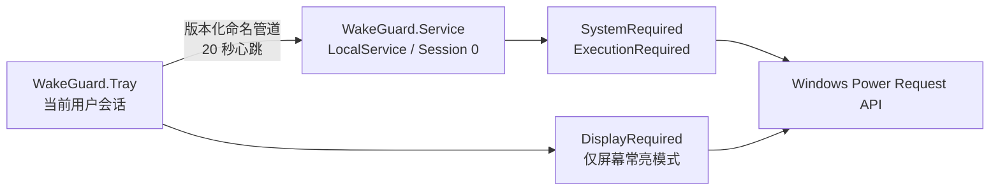

<div align="center">
  
  <h1>WakeGuard</h1>
  <p>让 Windows 在锁屏或自动关闭显示器后继续工作。</p>
</div>

WakeGuard 是面向 Windows 10/11 x64 的轻量托盘程序。它阻止因用户空闲触发的睡眠或 Modern Standby，同时保留 Windows 原有的显示器关闭、自动锁屏、电源计划和合盖策略。

WakeGuard 不模拟鼠标或键盘，不定期制造“用户活动”，也不修改系统电源计划。它通过 Windows 官方 Power Request API 工作，并由低权限后台服务保证锁屏后的可靠性。

## 功能

| 托盘菜单 | 系统保持唤醒 | 显示器保持点亮 | 额外操作 |
| --- | :---: | :---: | --- |
| **保持唤醒** | 是 | 否 | 显示器关闭和自动锁屏仍由 Windows 管理 |
| **保持唤醒 · 屏幕常亮** | 是 | 是 | 阻止显示器因空闲关闭 |
| **保持唤醒 · 立刻锁屏** | 是 | 否 | 服务确认唤醒成功后锁定工作站 |
| **保持唤醒 · 播放屏保** | 是 | 否 | 启动当前屏保；未配置时使用 Windows 黑屏屏保 |
| **退出唤醒状态** | 否 | 否 | 释放请求，但保留托盘程序 |
| **定时退出唤醒状态** | 取决于当前模式 | 取决于当前模式 | 支持 30 分钟、1、2 或 4 小时 |
| **退出** | 否 | 否 | 释放请求并退出托盘程序 |

托盘图标也会显示当前状态：灰白色为未唤醒，黄色为保持唤醒，橙红色为保持唤醒且屏幕常亮。

> 播放屏保并不自动锁屏。恢复时是否要求登录，取决于 Windows 的“在恢复时显示登录屏幕”设置。普通程序也无法在已经锁定的安全桌面上继续覆盖播放第三方屏保。

## 快速开始

### 安装

1. 获取 `WakeGuard-<version>-win-x64.msi`。本地构建的当前版本位于 `artifacts\installer\WakeGuard-0.1.4-win-x64.msi`。
2. 双击 MSI，并接受 Windows 的管理员权限提示。管理员权限只用于安装服务和写入 `Program Files`。
3. 安装结束后，从开始菜单启动一次 **WakeGuard**。以后每次登录 Windows，托盘程序都会自动启动。
4. 在任务栏通知区域右键 WakeGuard 杯子图标，选择需要的模式。

当前构建尚未进行 Authenticode 代码签名，因此 Windows 可能显示“未知发布者”。在正式对外发布前应使用可信证书签名 MSI 和两个 EXE。

### 升级

直接运行版本号更高的 MSI。安装器会关闭旧托盘、停止服务、更新文件并重新启动服务。升级后如托盘未立即出现，从开始菜单启动 WakeGuard 即可。

### 卸载

在 Windows **设置 → 应用 → 已安装的应用** 中卸载 WakeGuard。卸载器会先停止服务并清除 Power Request，不需要手工恢复电源计划。

## 工作原理



- `WakeGuard.Tray.exe` 负责菜单、状态图标、锁屏、屏保，以及屏幕常亮模式所需的 `PowerRequestDisplayRequired`。它运行在交互会话中，不请求管理员权限。
- `WakeGuard.Service.exe` 以 `NT AUTHORITY\LocalService` 运行，持有 `PowerRequestSystemRequired` 和 `PowerRequestExecutionRequired`。因此切换到锁屏安全桌面后，系统级唤醒请求仍然存在。
- Windows 不支持 Session 0 服务设置 `DisplayRequired`，所以显示请求必须由托盘进程持有；托盘退出或崩溃后，该句柄会被 Windows 自动释放。

托盘向服务申请一个短期租约，并每 20 秒续租。服务在 75 秒内收不到心跳就自动释放对应请求。多个 Windows 用户同时登录时，每个用户的租约互相隔离，系统采用所有有效租约中最强的模式。

更完整的进程、IPC、安全和失败恢复设计见 [架构文档](docs/architecture.md)。

## 验证运行状态

启用模式后，在管理员 PowerShell 中运行：

```powershell
powercfg /requests
```

预期结果：

| 当前模式 | `DISPLAY` | `SYSTEM` | `EXECUTION` |
| --- | --- | --- | --- |
| 未保持唤醒 | 无 WakeGuard | 无 WakeGuard | 无 WakeGuard |
| 保持唤醒 | 无 WakeGuard | `WakeGuard.Service.exe` | `WakeGuard.Service.exe` |
| 保持唤醒 · 屏幕常亮 | `WakeGuard.Tray.exe` | `WakeGuard.Service.exe` | `WakeGuard.Service.exe` |

也可以检查服务：

```powershell
Get-Service WakeGuard
sc.exe qc WakeGuard
```

服务应为 `Running`、自动启动，账户应为 `NT AUTHORITY\LocalService`。

## 故障排查

### 托盘图标没有出现

- 检查任务栏通知区域的折叠菜单。
- 从开始菜单重新启动 WakeGuard。程序会阻止同一用户会话重复运行多个托盘实例。
- 检查 `%LOCALAPPDATA%\WakeGuard\tray.log`。

### 显示“后台服务未连接”

在管理员 PowerShell 中运行：

```powershell
Get-Service WakeGuard
Start-Service WakeGuard
Get-Content C:\ProgramData\WakeGuard\service.log -Tail 100
```

如果服务不存在或文件损坏，重新运行当前 MSI 并选择修复，或者先卸载后重新安装。

### 显示器关闭后电脑仍然睡眠

1. 用 `powercfg /requests` 确认 `SYSTEM` 和 `EXECUTION` 中存在 `WakeGuard.Service.exe`。
2. 用 `powercfg /a` 查看机器实际支持的睡眠模型。
3. 检查厂商电源管理软件、组策略、低电量策略和合盖策略是否主动触发睡眠或休眠。

WakeGuard 只阻止“用户空闲”导致的自动睡眠。它不会阻止用户主动点击睡眠、关机或重启，也不会覆盖合盖、低电量休眠、过热保护、系统更新重启和固件级策略。

### 屏幕常亮时报 `PowerSetRequest(DisplayRequired) failed`

升级到 `0.1.1` 或更高版本。旧实现曾尝试从 Session 0 服务设置 `DisplayRequired`，部分 Windows 设备会返回错误 50。当前版本由交互会话中的托盘进程持有显示请求。

### 日志位置

```text
C:\ProgramData\WakeGuard\service.log
%LOCALAPPDATA%\WakeGuard\tray.log
```

日志写入失败不会改变或中断 Power Request。当前日志尚未实现自动轮转；长时间部署时需要关注文件大小。

## 安全与恢复设计

- 后台服务使用低权限 `LocalService`，不以 `LocalSystem` 或用户管理员身份运行。
- 命名管道带有显式 ACL，不接受匿名或网络登录令牌。
- 服务通过管道客户端模拟读取真实 Windows SID，不信任客户端 JSON 中自报的身份。
- IPC 使用 4 字节长度前缀，并在反序列化前限制为 16 KiB。
- 托盘崩溃或被强制结束后，租约最多 75 秒失效；显示请求则随进程句柄立即释放。
- 服务崩溃后由 Service Control Manager 自动重启，托盘会在下一次心跳重建租约。
- 重启电脑后始终从未唤醒状态开始，不会悄悄恢复上次模式。

## 开发

### 环境要求

- Windows 10/11 x64
- .NET 10 SDK `10.0.302`；[global.json](global.json) 固定了 SDK 功能带
- 构建 MSI 时需要联网还原 WiX Toolset 5 NuGet 包

### 目录结构

```text
assets/icon-source/        原始 normal、awake、light 状态图
docs/                      架构和手工测试文档
installer/                 WiX 5 MSI 工程
scripts/Build.ps1          完整发布构建入口
src/WakeGuard.Contracts/   版本化 IPC 消息和有限长度帧
src/WakeGuard.Core/        与平台无关的租约状态机
src/WakeGuard.Service/     LocalService Windows Service
src/WakeGuard.Tray/        WinForms 托盘和交互会话功能
src/WakeGuard.Windows/     Power Request、命名管道和 Windows API 封装
tests/                     核心与 Windows 集成测试
tools/WakeGuard.IconGenerator/  多尺寸 PNG/ICO 生成器
```

`bin`、`obj`、`artifacts` 和用户本地 IDE 文件都在 [.gitignore](.gitignore) 中。版本号只在 [Directory.Build.props](Directory.Build.props) 中维护，应用和 MSI 会继承同一个值。

### 构建与测试

```powershell
dotnet restore .\WakeGuard.slnx
dotnet build .\WakeGuard.slnx --configuration Release --no-restore
dotnet test .\WakeGuard.slnx --configuration Release --no-build
```

主解决方案故意不包含安装器，因此全新克隆后可以先构建和测试应用，不要求已有发布目录。

完整发布构建：

```powershell
.\scripts\Build.ps1
```

发布脚本会依次：

1. 从 `assets\icon-source` 重新生成应用和托盘图标；
2. 运行全部自动测试；
3. 发布自包含、单文件的 `win-x64` 托盘 EXE，以及低内存 Native AOT 服务 EXE；
4. 使用 WiX Toolset 5 生成高压缩 MSI。

输出位于：

```text
artifacts\publish\win-x64\Tray\
artifacts\publish\win-x64\Service\
artifacts\installer\WakeGuard-<version>-win-x64.msi
```

详细测试矩阵见 [docs/testing.md](docs/testing.md)。

### 图标资源

三张原始状态图保存在 `assets\icon-source`。生成器会输出三种状态的 `16/20/24/32/48/64px` 托盘 ICO、预览 PNG，以及包含到 `256px` 的程序图标。`awake.png` 是程序主图标来源。

不要手工编辑 `src\WakeGuard.Tray\Assets` 下的生成文件；修改源图或生成器后，运行：

```powershell
dotnet run --project .\tools\WakeGuard.IconGenerator\WakeGuard.IconGenerator.csproj --configuration Release -- .\assets\icon-source .\src\WakeGuard.Tray\Assets
```

## 许可证

[MIT License](LICENSE)
