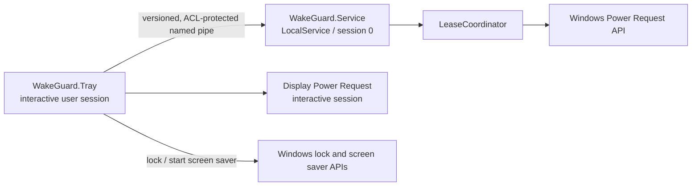

# WakeGuard architecture

## Goals

WakeGuard keeps Windows in the working state after the display turns off or the interactive session is locked. It must never leave a permanent power request behind after its user-facing process crashes or a user signs out.

The application does not simulate input and does not modify the user's sleep, display, lock-screen, lid-close, or battery policies. It uses the documented Windows Power Request API.

## Process model

- `WakeGuard.Tray` owns interactive-session operations and never elevates.
- `WakeGuard.Service` owns the machine-wide Power Request and runs as `LocalService`.
- `WakeGuard.Core` contains the platform-independent lease state machine.
- `WakeGuard.Windows` contains Windows API and pipe-security adapters.
- `WakeGuard.Contracts` contains versioned IPC messages and bounded framing.

## Lease model

Every tray process creates a random lease identifier and renews it periodically. A lease contains the authenticated Windows user SID, a random client identifier, the requested mode, a short heartbeat deadline, and an optional user-selected stop time.

The service obtains the SID by impersonating the connected pipe client; it never trusts a SID sent in JSON. The effective machine mode is the strongest unexpired lease. Fast User Switching is therefore safe: exiting one user's tray cannot cancel another user's request.

If heartbeats stop, the service expires the lease and clears or downgrades its Power Request. The expiry scheduler sleeps until the nearest actual deadline and waits indefinitely when there are no leases, so the idle service does not poll. A service restart loses its in-memory leases, but a running tray recreates its lease on the next heartbeat. A reboot always starts inactive.

The service uses `PowerRequestSystemRequired` and `PowerRequestExecutionRequired` for every active lease. Windows returns `ERROR_NOT_SUPPORTED` when a Session 0 service attempts `PowerRequestDisplayRequired`, so the interactive tray process owns that request only for display-on mode. The display handle is process-bound and is released automatically if the tray exits or crashes; the service lease still protects system-awake state independently.

## IPC and security

IPC uses one local duplex named pipe. Messages have a four-byte little-endian length prefix and a strict size limit before JSON deserialization. The protocol has an explicit integer version.

The pipe grants full control to `LocalSystem` and `LocalService`, read/write to interactive logon tokens, and no anonymous or network-logon access. Lease ownership is keyed by the pipe client's authenticated SID plus its random client identifier.

## Failure behavior

- Tray crash or forced termination: lease expires after the heartbeat grace period.
- Service crash: Service Control Manager restarts it and the tray recreates its lease.
- Pipe timeout: tray retries and does not claim an unconfirmed mode is active.
- Power API failure: service returns an error and preserves the last confirmed state.
- Timer expiry: service expires the lease even if the tray UI is busy.
- Reboot: no wake mode is restored automatically.

## Packaging

Release builds target .NET 10 LTS and publish self-contained `win-x64` executables. The background service uses Native AOT to minimize its resident runtime footprint. The final MSI installs both executables per machine, registers the service under `LocalService`, creates required ACLs, and starts the tray at user logon. Binaries are designed for Authenticode signing when a certificate is available.
